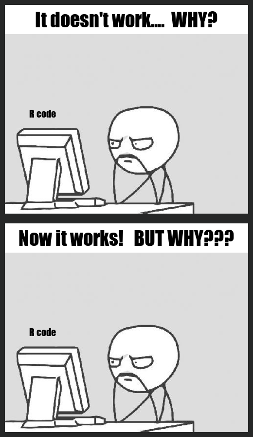

# HERE IS MY MEME!



## About my meme   
Being a Computer Science student, I had experiences in using different coding language.     
- Sometimes I generate an error and start to debug.       
- Sometimes I write a bunch of code that I'm not sure about it but it works fine. 

This meme perfectly describes those funny situations I use to have.      
So I decided to remake it and using ***R package {magick}***.     
I found the picture from the [here](https://imgflip.com/memetemplate/Computer-Guy). 

## My R code 

```
{
library(magick)

#text box 1
text1 <- image_blank(width = 500,
                     height = 60,
                     color = "#FFFFFF") %>%
  image_annotate(text = "It doesn't work....  WHY?",
                 color = "#000000",
                 size = 40,
                 font = "Impact",
                 gravity = "center")

#text box 2
text2 <- image_blank(width = 500,
                     height = 60,
                     color = "#FFFFFF") %>%
  image_annotate(text = "Now it works!   BUT WHY???",
                 color = "#000000",
                 size = 40,
                 font = "Impact",
                 gravity = "center")

#computer man  
computer_man <- image_read("image/ComputerMan.jpg") %>%
  image_scale("500") %>%
  image_annotate(text = "R code",
                 color = "#000000",
                 size = 20,
                 font = "Impact",
                 location = "+50+150")

#part 1
part1 <- image_append(c(text1, computer_man), 
                      stack = TRUE)
part1 <- image_border(part1, 
                      "#262727", 
                      "10x10")

#part 2
part2 <- image_append(c(text2, computer_man), 
                      stack = TRUE)
part2 <- image_border(part2,
                      "#262727",
                      "10x10")

#final step
meme <- image_append(c(part1, part2), 
                     stack = TRUE)

image_write(meme, "meme.png")
}
```

